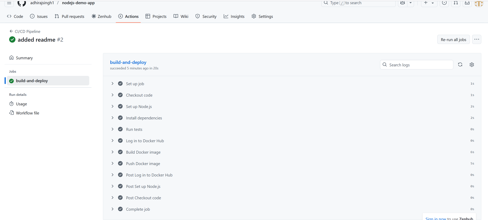
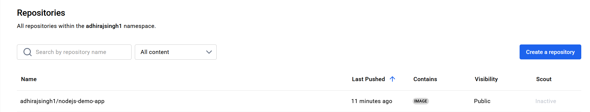

# nodejs-demo-app
Practicing automating the process of testing, building, and deploying a Node.js app using Docker and GitHub Actions.

1. Setting Up the Node.js App
   - We created a simple Node.js app that listens on port `3000` and responds with the text **“Hello, CI/CD World!”**.

2. Creating package.json

    I defined the basic dependencies and scripts for the Node.js app in the package.json file.

3. Dockerizing the Application

    I added a Dockerfile to containerize the Node.js app. The Docker image is built using the official Node.js Alpine base image.

4. Setting Up GitHub Actions Workflow

    I created the .github/workflows/main.yml file to automate the CI/CD pipeline. The workflow does the following:

        Triggers on a push to the main branch.

        Checks out the code from the repository.

        Installs Node.js dependencies.

        Runs tests (currently a placeholder test).

        Builds a Docker image for the Node.js app.

        Pushes the image to Docker Hub.

5. Docker Hub Account and Access Token

    I used our existing Docker Hub account and created a Docker Hub Access Token to authenticate GitHub Actions with Docker Hub.

    The token and Docker Hub username were added as secrets in the GitHub repository 

6. Pushing Code and Triggering the CI/CD Pipeline

    I pushed the code to the main branch of the GitHub repository, which triggered the CI/CD workflow.

    The workflow:

        Installed dependencies

        Ran tests

        Built the Docker image

        Pushed the Docker image to Docker Hub

7. Verifying the Docker Image

    After the workflow completed successfully, I checked Docker Hub to verify that the image was pushed and is available for deployment.

## CI/CD Pipeline Screenshot

Below is a screenshot showing the successful run of the CI/CD pipeline on GitHub Actions:

## Docker Hub Image Screenshot

This is a screenshot from Docker Hub showing that the Docker image has been successfully pushed:

